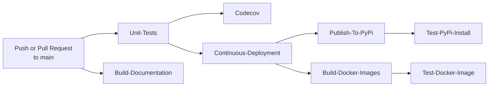

# Continuous Integration and Continuous Deployment Diagram

```mermaid
graph LR
  A[Push or Pull Request\nto main] --> B[Unit-Tests]
  B --> C[Codecov]
  B --> D[Continuous-Deployment]
  D --> E[Publish-To-PyPi]
  D --> F[Build-Docker-Images]
  E --> G[Test-PyPi-Install]
  F --> H[Test-Docker-Image]
  A --> I[Build-Documentation]

```
