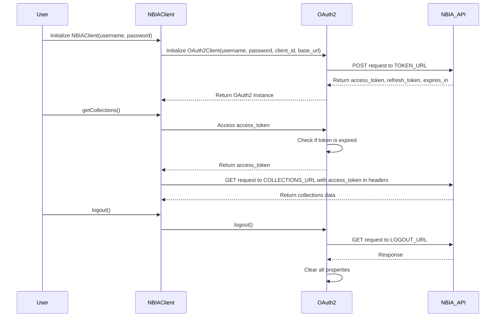

# Sequence Diagram
## Date: 2024-03-17

```mermaid
sequenceDiagram
    participant User
    participant NBIAClient
    participant OAuth2
    participant NBIA_API
    User->>NBIAClient: Initialize NBIAClient(username, password)
    NBIAClient->>OAuth2: Initialize OAuth2Client(username, password, client_id, base_url)
    OAuth2->>NBIA_API: POST request to TOKEN_URL
    NBIA_API-->>OAuth2: Return access_token, refresh_token, expires_in
    OAuth2-->>NBIAClient: Return OAuth2 instance
    User->>NBIAClient: getCollections()
    NBIAClient->>OAuth2: Access access_token
    OAuth2->>OAuth2: Check if token is expired
    OAuth2-->>NBIAClient: Return access_token
    NBIAClient->>NBIA_API: GET request to COLLECTIONS_URL with access_token in headers
    NBIA_API-->>NBIAClient: Return collections data
    User->>NBIAClient: logout()
    NBIAClient->>OAuth2: logout()
    OAuth2->>NBIA_API: GET request to LOGOUT_URL
    NBIA_API-->>OAuth2: Response
    OAuth2->>OAuth2: Clear all properties
```
